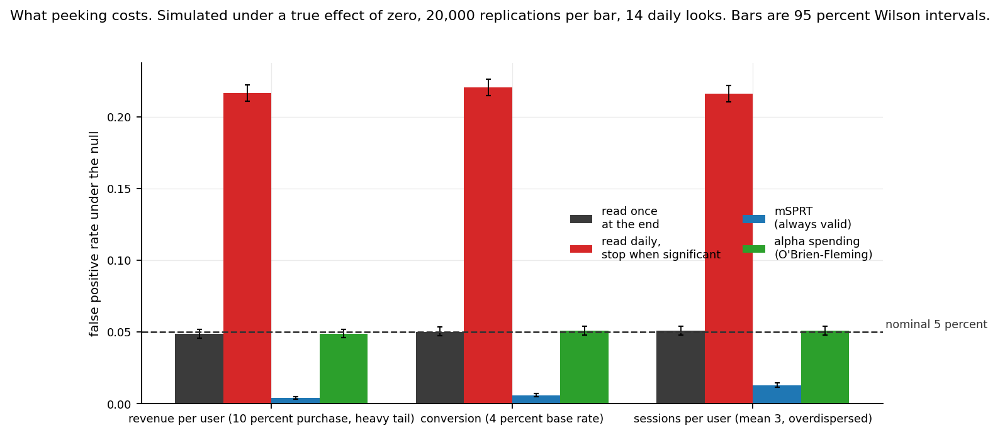
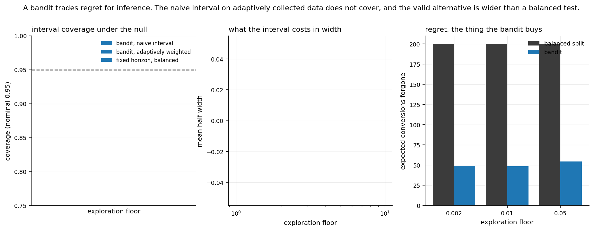

# What actually reduces the sample size you need

[](https://github.com/JAYANSHUBADLANI/experimentation-cost-study/actions/workflows/tests.yml)

I built this to answer a question I get asked on experimentation teams and have
never seen answered with measurements: given a metric and an effect size you
care about, which of the standard techniques actually reduces what an
experiment costs, and by how much?

Almost every A/B portfolio project is a calculator. A t-test wrapped in a
function, a sample size formula next to it. That demonstrates knowing the
formula. It does not demonstrate knowing which choices change what an
experiment costs. So this measures the choices instead.

The claim I set out to test, stated up front so the results can contradict it:

> Most of what a team can win comes from variance reduction, not from a more
> sophisticated test. A better estimator buys more than a better p value.

## Status

This is a partial build. What is finished has been run end to end and every
number below came out of the code. What is not finished is listed as not
finished rather than quietly dropped.

| Phase | State |
|---|---|
| 1. Metric simulator, calibration, estimators, tests | complete |
| 2. Power and sample size study, CUPED correlation curve | complete |
| 3. Peeking study, sequential procedures, SRM detection | complete |
| 4. Bandit comparison, Criteo real data arm, the guide | bandit and guide complete, Criteo not started |

The Criteo arm is blocked on the data. The Kaggle download failed partway
(722 MB of about 1 GB, the browser recorded a network error), so the real data
arm has not been run at all. I have not substituted anything for it or implied
it was done.

## Headline result so far

At a pre period correlation of 0.5, which is a realistic value for an active
user base, CUPED style regression adjustment removes about a quarter of the
users an experiment needs. That holds across all three metric families and all
three effect sizes I measured.

| estimator | mean users saved, across 9 scenarios |
|---|---|
| CUPED plus strata | 27.0 percent |
| CUPED | 25.3 percent |
| Lin regression adjustment | 25.2 percent |
| post stratified (pre period quintiles) | 15.8 percent |
| difference in means | 0 by definition, it is the baseline |

## The CUPED correlation curve

CUPED's gain is entirely about the correlation between the pre period
covariate and the outcome, so reporting one saving figure without it is
meaningless. I measured the full curve, ten correlation values from 0 to 0.9,
across all three metrics, 800 replications per point, and it lands almost
exactly on the textbook 1 minus rho squared line: the largest deviation from
theory anywhere in the grid is 0.5 percent of the variance ratio.

| target correlation | variance ratio (revenue) | theory, 1 minus rho squared | users saved |
|---|---|---|---|
| 0.1 | 0.990 | 0.990 | 1.0 percent |
| 0.3 | 0.910 | 0.910 | 9.1 percent |
| 0.5 | 0.749 | 0.750 | 25.1 percent |
| 0.7 | 0.509 | 0.510 | 49.1 percent |
| 0.9 | 0.189 | 0.190 | 81.1 percent |

The saving crosses 10 percent of users at a correlation of about 0.32, which
matches the closed form break even point of sqrt(0.10) = 0.316 exactly. Below
that, in my view, the plumbing of building and maintaining a pre period feature
pipeline is not obviously worth it for what the sample size buys. Above a
correlation of about 0.7, each extra 0.1 of correlation is worth more, not
less: the curve is convex in this range, so a team with genuinely good pre
period signal should push for it rather than settle for a weak covariate.

Full curve, all three metrics, is in `results/cuped_curve.csv` and
`figures/fig03_cuped_curve.png`.

Whether any of this beats a sequential test is answered below, in the peeking
section, and the answer is that the two are not substitutes: variance reduction
buys sample size, a sequential procedure buys the right to stop early without
lying about the error rate. Both are worth having and neither replaces the
other.

All of these are simulation results. Nothing here is measured on real
experimental data yet.

## The power and sample size study

Total users needed for 80 percent power at a two sided alpha of 0.05, measured
over 1,500 replications per design point, 11,219,604,000 simulated users in
total, in 1,445 seconds on 7 workers.

Every one of these numbers is a simulation at a stated true effect. The true
relative lift is in the second column and a power figure without it means
nothing.

| metric | true lift | difference in means | CUPED | post stratified | CUPED saves |
|---|---|---|---|---|---|
| revenue per user, 10 percent purchase | 5.0 percent | 340,501 | 254,708 | 305,691 | 25.2 percent |
| revenue per user | 7.5 percent | 151,235 | 112,406 | 136,912 | 25.7 percent |
| revenue per user | 10.0 percent | 87,557 | 65,030 | 78,721 | 25.7 percent |
| conversion, 4 percent base | 5.0 percent | 311,896 | 231,201 | 265,857 | 25.9 percent |
| conversion | 7.5 percent | 137,684 | 101,972 | 116,162 | 25.9 percent |
| conversion | 10.0 percent | 79,229 | 59,137 | 66,380 | 25.4 percent |
| sessions per user, mean 3 | 2.0 percent | 129,781 | 97,242 | 100,098 | 25.1 percent |
| sessions per user | 3.0 percent | 57,112 | 43,552 | 45,318 | 23.7 percent |
| sessions per user | 5.0 percent | 20,980 | 15,802 | 16,371 | 24.7 percent |

Two things in that table are worth pausing on.

The first is that I computed the required sample size two independent ways and
report both. One reads it off the measured power curve by fitting the one
parameter that curve has on the probit scale. The other predicts it from the
variance each estimator actually achieved. They agree to within 3.0 percent at
worst and about 1 percent typically. They are different routes to the same
number, and if they disagreed it would mean something was wrong.

The second is that post stratification is worth much less on the heavy tailed
revenue metric (about 10 percent) than on the overdispersed count metric
(about 23 percent), while CUPED is worth about the same on both. Quintiles of
a pre period covariate throw away the within stratum variation, and on a metric
whose variance lives almost entirely in the tail, that is most of the signal.
The continuous adjustment keeps it.

Lin's interacted estimator lands on top of CUPED to three significant figures
in every scenario. That is expected under random assignment with no treatment
effect heterogeneity in the covariate slope, and it is the reason I included
it: it means the adjusted baseline is not a straw man that only looks good
because I implemented the robust version badly.

### Effects too small to simulate

The effects a team actually argues about are smaller than the ones above, and
they need sample sizes too large to simulate thousands of times. A 1 percent
relative lift on the 4 percent conversion metric needs about 7.5 million users
for a plain test, which at 1,500 replications is not a study, it is an
overnight job. Those cases are reported from the measured variance rather than
simulated directly, and are labelled that way wherever they appear. The
variance ratio that CUPED achieves is scale free, so extending it downwards is
legitimate. Extending the power measurement itself would not be.

## Calibrating the simulated distribution

A Gaussian simulation would have flattered every method in this study, so the
metric distribution is calibrated to a real one and the evidence is committed.

Shape source: the Olist Brazilian E-Commerce public dataset, order payment
value aggregated to one value per order, 98,815 orders. What I took from it is
the shape of the positive part of revenue. What I did not take from it is the
zero rate or the pre and post correlation: Olist's repeat purchase rate is 3.0
percent, so its per user monthly panel is not representative of the
populations this study is about. The zero rate is a stated parameter and the
correlation is swept.

I fitted a single lognormal first and rejected it. The empirical skew is 9.19
and a lognormal fitted to the same values implies about 3.8. The model I use
instead is spliced: lognormal below the 95th percentile, generalized Pareto
above it, each piece fitted by maximum likelihood.

| statistic | Olist, empirical | spliced fit | lognormal only | lognormal / empirical |
|---|---|---|---|---|
| mean | 160.56 | 167.10 | 151.53 | 0.94 |
| standard deviation | 220.15 | 221.90 | 145.78 | 0.66 |
| coefficient of variation | 1.371 | 1.328 | 0.962 | 0.70 |
| 99th percentile | 1,066.75 | 1,067.81 | 717.99 | 0.67 |
| 99.9th percentile | 2,337.60 | 2,471.88 | 1,332.26 | 0.57 |

This is the load bearing step, not decoration. Required sample size scales with
the square of the coefficient of variation, so **had I used a plain lognormal I
would have understated every revenue sample size in this study by a factor of
1.91.** A Gaussian would have been far worse again.

Fitted parameters are in `results/revenue_shape.json`, the empirical summary
that the figure is drawn from is in
`results/calibration_empirical_summary.csv`, and a 20,000 value sample is
committed at `data/sample/olist_order_values_sample.csv` so the test suite runs
with no network call and no raw data.

The three metric families, with their exact moments by quadrature:

| metric | mean | variance | coefficient of variation |
|---|---|---|---|
| revenue per user, 10 percent purchase | 16.711 | 7,460.50 | 5.169 |
| conversion, 4 percent base | 0.0400 | 0.0384 | 4.899 |
| sessions per user, mean 3, dispersion 0.8 | 3.0000 | 14.2500 | 1.258 |

## Sample ratio mismatch

An imbalanced design is not a sample ratio mismatch. An 85/15 split is valid if
85/15 is what was intended. The test always compares the observed split against
the intended one, whatever that is, so a deliberate imbalance never fires and a
drift away from a deliberate 85/15 still does. There is a test for exactly this
distinction in the suite.

Using a chi square goodness of fit test at a p value threshold of 0.0005,
measured over 4,000 replications per cell and cross checked against the closed
form non central chi square:

| total users | smallest drift detectable at 80 percent power |
|---|---|
| 10,000 | 2.16 percentage points |
| 50,000 | 0.97 |
| 100,000 | 0.68 |
| 500,000 | 0.31 |
| 1,000,000 | 0.22 |

The threshold of 0.0005 is a convention, chosen so a healthy experiment almost
never trips it at platform scale while the bugs that cause mismatches almost
always do. My recommendation is to discard on a trip rather than adjust,
because a mismatch means users went missing non randomly and there is no
correction for an unknown selection process.

## Sequential procedures

A sequential test is a family, not a method, so both procedures here are named,
cited and implemented in full.

The mixture sequential probability ratio test with a normal mixing density,
from Johari, Pekelis and Walsh, "Always Valid Inference: Continuous Monitoring
of A/B Tests". This one is always valid: look as often as you like, stop when
you like, the error is still bounded.

Group sequential boundaries from Lan and DeMets (1983) alpha spending with the
O'Brien and Fleming (1979) spending function, computed by the Armitage,
McPherson and Rowe recursion rather than an approximation to it. This one needs
a pre committed maximum sample size.

I validated the recursion against the classical O'Brien-Fleming boundaries for
five equally spaced looks, which are tabulated in the literature as 4.5617,
3.2256, 2.6296, 2.2777, 2.0378. My implementation reproduces them to within
0.004. The alpha spending boundaries it produces spend exactly 0.05 overall.

## What peeking actually costs

Ran at 20,000 replications per metric, 14 daily looks at 10,000 users a day,
8.4 billion simulated users, in 132 seconds. Every run here is under the null,
so a correct procedure should reject 5 percent of the time and nothing more.

| metric | fixed horizon | naive peeking | mSPRT | alpha spending |
|---|---|---|---|---|
| revenue per user | 0.0486 | **0.2165** | 0.0041 | 0.0490 |
| conversion | 0.0503 | **0.2203** | 0.0059 | 0.0508 |
| sessions per user | 0.0510 | **0.2160** | 0.0130 | 0.0510 |

Rejection rates under no true effect, nominal alpha 0.05. Full table with
Wilson intervals in `results/peeking.csv`.



**Looking every day for a fortnight and stopping at the first significant
result rejects a true null about 22 percent of the time.** That is four and a
third times the rate the test claims, and it is the single most expensive
mistake available to a team that reads its dashboard daily. The fixed horizon
column is the control: it sits on 0.05 in all three metrics, which is what says
the simulator and the test are behaving.

Both corrections work, and they fail in opposite directions. Alpha spending
lands almost exactly on nominal, 0.049 to 0.051 across the three metrics. The
mSPRT is conservative rather than exact, rejecting 0.4 to 1.3 percent where 5
is allowed, which is the price of validity at every possible stopping time
rather than at fourteen pre committed ones.

The cost of the correction is smaller than the error it prevents. Keeping 80
percent power under O'Brien-Fleming alpha spending at 14 looks needs
**1.060 times** the fixed horizon sample size, from
`results/sequential_cost.csv`. Six percent more users buys back a false
positive rate that was otherwise inflated fourfold.

Set against the CUPED result above, the two levers are not interchangeable. At
a pre period correlation of 0.5, variance reduction removes about 25 percent of
the users needed. Sequential monitoring adds about 6 percent to whatever that
number is, and in exchange the team may stop early and act on the result
honestly. A team doing both pays 1.06 times 0.75, about 0.79 of the original
sample, and still gets to look every day.

## What a bandit costs you at the analysis stage

A bandit sends traffic to whichever arm is winning, which is the point of it,
and that is exactly what breaks the confidence interval computed afterwards.
The allocation depends on the outcomes already observed, so the arm means are
not independent samples any more. 2,000 replications per cell, 200 rounds of
500 users, two arms at 4.0 and 4.4 percent.

Coverage of a nominal 95 percent interval, under the null where both arms are
genuinely 4.0 percent:

| exploration floor | naive interval | adaptively weighted | fixed horizon balanced |
|---|---|---|---|
| 0.050 | 0.918 | 0.946 | 0.949 |
| 0.010 | **0.872** | 0.941 | 0.955 |
| 0.002 | **0.855** | 0.935 | 0.947 |

**The exploration floor is what controls whether the analysis is valid, not the
bandit algorithm itself.** Hold 5 percent of traffic back for forced
exploration and the naive interval covers at 91.8 percent, which is wrong but
survivable. Drop the floor to 0.2 percent, which is what a team chasing regret
would want, and coverage falls to 85.5 percent. A nominal 95 percent interval
that actually covers 85.5 percent of the time is not a rounding error, it is
one in seven conclusions being wrong at a rate the analyst thinks is one in
twenty.

The adaptively weighted estimator recovers most of it, 0.935 to 0.946 across
the same floors, at the cost of a wider interval: mean half width 0.00408
against the naive 0.00330 at the tightest floor. The fixed horizon balanced
design is the control and sits on nominal throughout, as it should.

And the regret the bandit buys in exchange, on the lift scenario:

| exploration floor | bandit regret | balanced regret | saved | share to best arm |
|---|---|---|---|---|
| 0.050 | 54.6 | 200.0 | 145.4 | 86.4 percent |
| 0.010 | 48.7 | 200.0 | 151.3 | 87.8 percent |
| 0.002 | 48.8 | 200.0 | 151.2 | 87.8 percent |

Regret barely improves between a 1 percent floor and a 0.2 percent floor, 151.3
against 151.2 of a possible 200, while coverage falls from 0.941 to 0.935 on the
weighted interval and from 0.872 to 0.855 on the naive one. So the tightest
floor buys essentially no extra regret saving and costs real validity. If you
run a bandit, a 1 percent floor gets you all the regret benefit that is
available and leaves the analysis in better shape than chasing the last tenth
of a percent.

Full tables in `results/bandit_intervals.csv` and `results/bandit_regret.csv`.



## The guide

`docs/guide.md` is the practitioner facing version: what to decide before an
experiment starts, which adjustment to use and when, how often you may look and
what it costs, what an SRM check can and cannot detect at your sample size, and
what to ask when someone proposes a bandit. Every figure in it comes from the
tables here.

## Reproducing this

```bash
make test          # the full test suite
make power         # the power and sample size grid, about 24 minutes on 7 workers
make cuped         # the CUPED correlation curve
make srm           # sample ratio mismatch
make figures       # every figure, from the committed result tables
```

`make calibrate` refits the revenue shape and needs the Olist CSVs, pointed at
with `EXPCOST_OLIST_DIR`. Everything else runs from committed results.

Determinism: every random number descends from one documented root seed
(`ROOT_SEED` in `src/expcost/seeds.py`) through `numpy.random.SeedSequence`.
The legacy global seed is never used. Streams are addressed by name rather than
by draw order, so adding a scenario or reordering the grid does not change the
numbers any other scenario sees, and parallel worker scheduling cannot affect a
result.

That is verified for the peeking and bandit studies rather than assumed: both
were run twice back to back and all four result tables, `peeking.csv`,
`sequential_cost.csv`, `bandit_intervals.csv` and `bandit_regret.csv`, are byte
identical between the runs, compared by SHA-256. The power grid and the CUPED
curve have not been through the same check, because each is a twenty minute run
and I have only run them once. So determinism is verified where it has been
tested and remains a design property on the two studies where it has not.

## What this does not cover

No network effects or interference between users. No switchback or geo
designs. No ratio metrics with delta method variance. No long term or holdout
effects. One bandit algorithm rather than a survey of them. Two sequential
procedures, both parametric. No
sequential testing of the variance reduced estimators jointly. Simulation only
so far: the real data arm has not been run.

## Honesty notes

Every number in this file was produced by running the code in this repository.
Nothing is recalled or estimated. Simulated rates carry their replication count
and an interval in the result tables. Every power number states the true effect
it was computed at.

The scenario grid in `config/scenarios.py` was fixed before the study ran. One
value changed after freezing and before any results existed: I reduced the
CUPED curve replication count from 1,500 to 800 while sizing the runtime
budget, before that study had been executed. No grid value has been changed
after seeing a result it affects.
